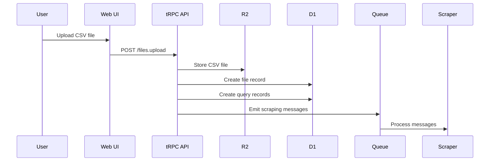
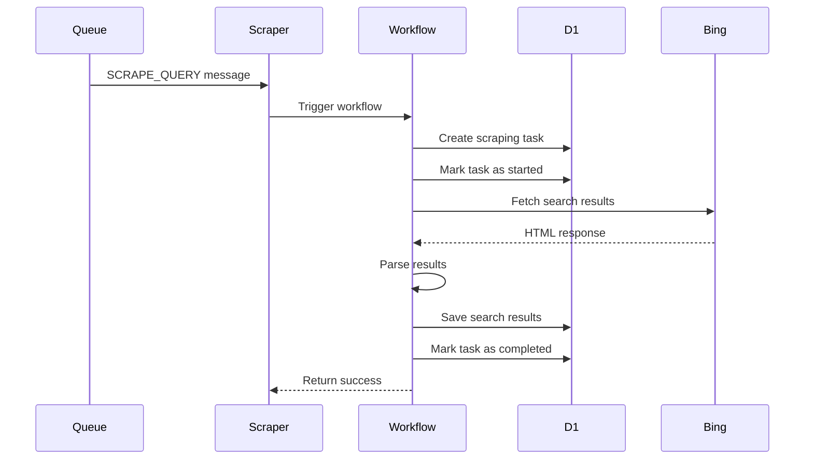
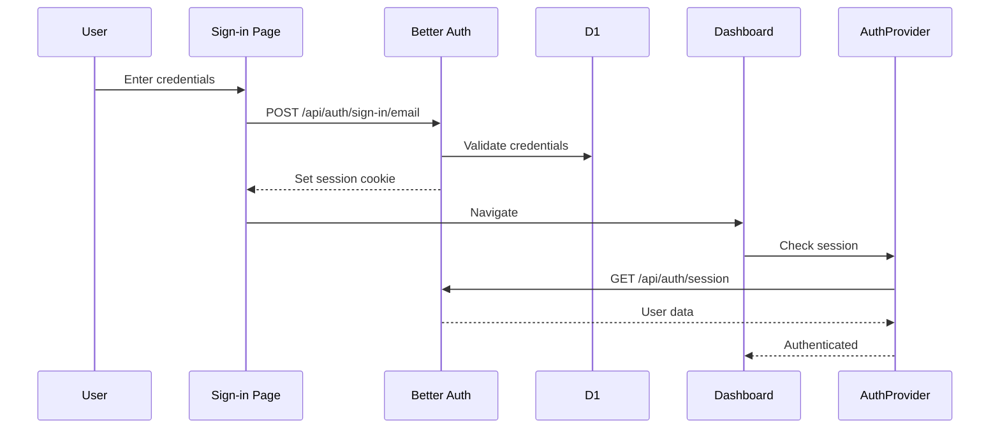

# Bing Scraper

A full-stack web application for scraping Bing search results with a modern, scalable architecture built on Cloudflare's edge platform.

## Overview

This project provides a comprehensive solution for uploading CSV files containing search queries, automatically scraping Bing search results, and displaying the data in a user-friendly interface. The application leverages Cloudflare's edge computing ecosystem for high performance, global availability, and cost-effective scalability.

## Features

- **CSV Upload & Processing**: Upload CSV files with search queries for batch processing
- **Asynchronous Scraping**: Background job processing with Cloudflare Queues and Workflows
- **Real-time Updates**: Track scraping progress and view results in real-time
- **Global Search**: Search across all scraped results by title, URL, snippet, or domain
- **File Downloads**: Download screenshots and HTML snapshots of search results with authenticated access
- **User Authentication**: Secure authentication system powered by Better Auth
- **Data Storage**: Efficient storage using Cloudflare D1 (database) and R2 (file storage)
- **Responsive UI**: Modern, accessible interface built with React and Tailwind CSS
- **Type-Safe API**: Full type safety across the stack with tRPC and TypeScript

## Architecture

### Tech Stack

#### Frontend
- **React 19** - UI library
- **TanStack Router** - Type-safe routing with file-based routing
- **TanStack Query** - Server state management
- **Tailwind CSS 4** - Utility-first styling
- **Radix UI** - Accessible component primitives
- **Framer Motion** - Animation library
- **Vite** - Build tool and dev server

#### Backend
- **Cloudflare Workers** - Edge compute platform
- **tRPC** - End-to-end type-safe APIs
- **Hono** - Lightweight web framework
- **Better Auth** - Authentication system
- **Zod** - Schema validation

#### Infrastructure (Cloudflare)
- **Pages** - Static site hosting
- **Workers** - Serverless compute
- **D1** - SQL database
- **R2** - Object storage
- **Queues** - Message queue for async tasks
- **Workflows** - Orchestration for scraping jobs
- **Browser Rendering** - Headless browser for scraping
- **KV** - Key-value store for metadata
- **Durable Objects** - Stateful coordination

#### Development Tools
- **TypeScript** - Type safety
- **pnpm** - Package manager
- **Wrangler** - Cloudflare deployment CLI
- **Vitest** - Unit testing framework with coverage
- **Playwright** - End-to-end testing framework
- **GitHub Actions** - CI/CD automation
- **ESLint & Prettier** - Code quality

## Project Structure

```
bing-scraper/
├── apps/
│   ├── web/                          # Main web application
│   │   ├── src/
│   │   │   ├── components/           # React components
│   │   │   │   ├── auth/             # Auth provider & hooks
│   │   │   │   ├── layout/           # Layout components
│   │   │   │   │   └── ui/               # UI components (Cards, States, Modal)
│   │   │   │   ├── routes/               # File-based routing
│   │   │   │   ├── __root.tsx        # Root layout with AuthProvider
│   │   │   │   ├── index.tsx         # Landing page
│   │   │   │   ├── sign-in.tsx       # Sign-in page
│   │   │   │   ├── sign-up.tsx       # Sign-up page
│   │   │   │   └── app/              # Authenticated routes
│   │   │   │       ├── _authed.tsx   # Protected route wrapper
│   │   │   │       └── _authed/      # Protected dashboard pages
│   │   │   │           ├── index.tsx # Dashboard with recent files
│   │   │   │           ├── search.tsx # Global search page
│   │   │   │           └── tasks/    # Task detail pages
│   │   │   ├── styles/               # Global styles (Tailwind CSS)
│   │   │   ├── hooks/                # Custom React hooks
│   │   │   ├── utils/                # Utility functions & tRPC client
│   │   │   ├── main.tsx              # Application entry point
│   │   │   └── router.tsx            # Router configuration
│   │   ├── worker/                   # Cloudflare Worker backend
│   │   │   ├── index.ts              # Worker entry point
│   │   │   └── trpc/                 # tRPC API
│   │   │       ├── router.ts         # Main router
│   │   │       ├── context.ts        # Request context (auth, db)
│   │   │       ├── trpc-instance.ts  # tRPC initialization
│   │   │       └── routers/          # API route handlers
│   │   │           ├── auth.ts       # Authentication endpoints
│   │   │           ├── files.ts      # File upload & management
│   │   │           └── queries.ts    # Query & search management
│   │   ├── public/                   # Static assets
│   │   ├── wrangler.jsonc            # Cloudflare Worker config
│   │   ├── vite.config.ts            # Vite configuration
│   │   ├── tsconfig.json             # TypeScript config
│   │   └── package.json
│   └── scraper/                      # Scraping worker
│       ├── src/
│       │   ├── index.ts              # Queue consumer & worker
│       │   └── workflows/            # Cloudflare Workflows
│       │       └── scraping-workflow.ts  # Main scraping orchestration
│       ├── wrangler.jsonc            # Scraper config (queues, workflows, browser)
│       ├── tsconfig.json
│       └── package.json
├── packages/
│   └── data/                         # Shared data layer
│       ├── src/
│       │   ├── auth.ts               # Better Auth configuration
│       │   ├── db/
│       │   │   └── database.ts       # Database initialization
│       │   ├── schemas/              # Drizzle ORM schemas
│       │   │   ├── users.ts
│       │   │   ├── sessions.ts
│       │   │   ├── accounts.ts
│       │   │   ├── uploaded-files.ts
│       │   │   ├── search-queries.ts
│       │   │   ├── scraping-tasks.ts
│       │   │   ├── search-results.ts
│       │   │   └── search-result-items.ts
│       │   ├── repos/                # Repository pattern
│       │   │   ├── uploaded-files.repo.ts
│       │   │   ├── search-queries.repo.ts
│       │   │   ├── scraping-tasks.repo.ts
│       │   │   └── search-results.repo.ts
│       │   ├── zod/                  # Zod validation schemas
│       │   │   ├── queue.ts          # Queue message schemas
│       │   │   ├── scraping-tasks.ts
│       │   │   ├── search-queries.ts
│       │   │   └── ...
│       │   └── __tests__/            # Unit tests
│       │       ├── mocks/            # Mock database helpers
│       │       ├── fixtures/         # Test data fixtures
│       │       └── repos/            # Repository tests
│       ├── drizzle/                  # Database migrations
│       ├── drizzle.config.ts         # Drizzle configuration
│       ├── vitest.config.ts          # Vitest configuration
│       ├── tsconfig.json
│       └── package.json
├── pnpm-workspace.yaml               # pnpm workspace configuration
├── package.json                      # Root package.json
├── REQUIREMENTS.MD                   # Detailed requirements
└── README.MD                         # This file
```

## How It Works

### 1. File Upload & Processing



### 2. Scraping Workflow



### 3. Authentication Flow



## Getting Started

### Prerequisites

- Node.js 18+ and pnpm
- Cloudflare account
- Wrangler CLI installed (`npm install -g wrangler`)

### Installation

1. **Clone the repository**
```bash
git clone https://github.com/akbarsahata/bing-scraper.git
cd bing-scraper
```

2. **Install dependencies**
```bash
pnpm install
```

3. **Set up Cloudflare resources**

Create required resources using Wrangler or Cloudflare Dashboard:

```bash
# Create D1 database
wrangler d1 create bing-scraper-db

# Create R2 bucket
wrangler r2 bucket create bing-scraper-storage

# Create Queue
wrangler queues create bing-scraper-queue
```

4. **Update wrangler.jsonc files**

Update the `database_id` in both `apps/web/wrangler.jsonc` and `apps/scraper/wrangler.jsonc` with your D1 database ID.

5. **Run database migrations**
```bash
cd packages/data
pnpm run migrate
```

6. **Build the data package**
```bash
pnpm run build
```

### Development

Run both applications in development mode:

```bash
# Terminal 1: Web app
cd apps/web
pnpm run dev

# Terminal 2: Scraper worker (optional for testing)
cd apps/scraper
pnpm run dev
```

Access the application at `http://localhost:5173`

### Deployment

Deploy to Cloudflare manually:

```bash
# Deploy web app
cd apps/web
pnpm run deploy

# Deploy scraper worker
cd ../scraper
pnpm run deploy
```

Or use the automated CI/CD pipeline (see [CI/CD Setup](./.github/CI_CD_SETUP.md)):
- Push to master → Tests run automatically
- Tests pass → Deploys to Cloudflare automatically

## Database Schema

The application uses 8 main tables:

- **users** - User accounts
- **sessions** - Authentication sessions
- **accounts** - OAuth provider accounts
- **uploaded_files** - CSV file metadata
- **search_queries** - Individual search queries
- **scraping_tasks** - Async scraping jobs
- **search_results** - Search result metadata
- **search_result_items** - Individual result items

See [REQUIREMENTS.MD](./REQUIREMENTS.MD) for the complete schema.

## API Endpoints

### Authentication (`/api/auth/*`)
- `POST /sign-in/email` - Email/password sign-in
- `POST /sign-up/email` - Create new account
- `POST /sign-out` - Sign out user
- `GET /session` - Get current session

### Files (`/trpc/files.*`)
- `files.upload` - Upload CSV file
- `files.getAll` - List user's files
- `files.getById` - Get file details
- `files.getRecent` - Get recent files

### Queries (`/trpc/queries.*`)
- `queries.getByFileId` - Get queries for a file
- `queries.getByQueryId` - Get results for a specific query
- `queries.search` - Global search across all results
- `queries.getDownloadLinks` - Generate authenticated download links

### Downloads (`/api/download`)
- `GET /api/download?key=<r2_key>&type=<screenshot|html>` - Download R2 files (authenticated)

## Environment Variables

Configure in Cloudflare dashboard or `wrangler.jsonc`:

```bash
# Not required for basic setup
# All configuration is in wrangler.jsonc
```

## Testing

### Unit Tests (Data Layer)

Run unit tests for the data layer:

```bash
# Run all tests
cd packages/data
pnpm run test

# Run tests in watch mode
pnpm run test:watch

# Run tests with coverage
pnpm run test:coverage
```

#### Unit Test Coverage

The data package includes comprehensive unit tests for all repository methods:

- **uploaded-files.repo.test.ts** - Tests for file management operations
- **search-queries.repo.test.ts** - Tests for query CRUD operations
- **search-results.repo.test.ts** - Tests for search result storage
- **scraping-tasks.repo.test.ts** - Tests for task orchestration

**Current Status**: ✅ 22 tests passing across 4 test files

The test suite uses:
- **Vitest** - Fast unit testing framework
- **Mock Database** - Custom Drizzle ORM mocks with proper array destructuring support
- **Test Fixtures** - Reusable test data for consistent testing
- **Type Safety** - Full TypeScript coverage in tests

### End-to-End Tests (Web Application)

Run E2E tests for the web application:

```bash
cd apps/web

# Run all E2E tests
pnpm run test:e2e

# Run tests with UI mode (interactive)
pnpm run test:e2e:ui

# Run tests in headed mode (see browser)
pnpm run test:e2e:headed

# Debug tests step by step
pnpm run test:e2e:debug
```

#### E2E Test Coverage

The web app includes end-to-end tests covering critical user flows:

- **auth.spec.ts** - Authentication flows (sign-in, sign-up, navigation, validation)
- **landing.spec.ts** - Landing page redirects and navigation
- **navigation.spec.ts** - Page navigation, headers, and routing
- **accessibility.spec.ts** - Form accessibility, input types, keyboard navigation

**Current Status**: ✅ 16 tests passing across 4 test files

The E2E suite uses:
- **Playwright** - Modern browser automation framework
- **Chromium** - Headless browser testing
- **Semantic Selectors** - `getByRole()`, `getByPlaceholder()` for maintainability
- **Auto-start Server** - Dev server starts automatically for tests
- **Automatic Retries** - 2 retries on failure in CI environments
- **HTML Reports** - Visual test reports with screenshots on failure

**Test Strategy:**
- Focus on unauthenticated flows (no database setup needed)
- Critical user paths: sign-in, sign-up, form validation
- Accessibility compliance: proper input types, required attributes
- Quick execution: ~5 seconds for full test suite

**Future Tests:**
- Authenticated dashboard flows
- File upload and CSV processing
- Search functionality
- Download modal interactions

## Features in Detail

### CSV Upload
- Validates CSV format and structure
- Requires "keyword" column
- Limits to 100 keywords per file
- Stores files in R2 for audit trail

### Asynchronous Processing
- Uses Cloudflare Queues for job distribution
- Cloudflare Workflows for orchestration
- Automatic retry on failures
- Progress tracking per query
- Sequential processing (1 job at a time) to avoid rate limits
- Real-time percentage calculation for file processing

### Search Result Extraction
- Fetches Bing search results
- Parses organic results
- Extracts title, URL, snippet, domain
- Identifies ads vs organic results
- Stores position information
- Captures screenshots and HTML snapshots
- Stores files in R2 with user isolation

### Global Search
- Search across all scraped results
- Searches in titles, URLs, snippets, and domains
- Real-time filtering with instant results
- User-specific search (only searches own data)
- Pagination support for large result sets

### File Downloads
- Authenticated download endpoint
- Screenshots (PNG format)
- HTML snapshots for archival
- On-demand generation of download links
- Modal interface for easy access
- Secure R2 file access with user authorization

### User Management
- Secure authentication with Better Auth
- Session management with cookies
- Protected routes with route guards
- Per-user data isolation

### Testing & Quality
- Comprehensive unit test coverage for data layer
- Mock database implementation for isolated testing
- Type-safe test fixtures and helpers
- CI/CD ready with Vitest

## Architecture Decisions

### Why Cloudflare?
- **Global Edge Network**: Low latency worldwide
- **Integrated Platform**: Workers, D1, R2, Queues all work together
- **Cost Effective**: Pay-per-use with generous free tier
- **Developer Experience**: Great DX with Wrangler

### Why tRPC?
- **Type Safety**: End-to-end type safety from DB to UI
- **No Code Generation**: Types inferred from implementation
- **Developer Experience**: Autocomplete and type checking

### Why Repository Pattern?
- **Separation of Concerns**: Business logic separate from data access
- **Testability**: Easy to mock for unit tests with comprehensive test coverage
- **Maintainability**: Centralized data access logic
- **Reusability**: Share logic between workers
- **Type Safety**: Full TypeScript inference through the data layer

### Why Workflows?
- **Reliability**: Automatic retries and state persistence
- **Observability**: Built-in monitoring and logs
- **Orchestration**: Complex multi-step processes
- **Durable Execution**: Survives worker restarts

## Authentication System

The application uses Better Auth for secure authentication with email/password support.

### Authentication Flow

1. **Sign Up**: Users create accounts with name, email, and password
2. **Sign In**: Credentials validated, session token stored in localStorage
3. **Protected Routes**: Token validated on every request via tRPC context
4. **Sign Out**: Token cleared, user redirected to sign-in page

### Security Features

- **Password Hashing**: Bcrypt hashing handled by Better Auth
- **Session Tokens**: Cryptographically secure tokens stored in database
- **Token Validation**: Every protected endpoint validates userId from context
- **Authorization Checks**: Per-user data isolation enforced at repository level
- **Protected Routes**: All `/app/*` routes require valid authentication

### Usage Examples

**Sign In:**
```tsx
const mutation = trpcReact.auth.signIn.useMutation({
  onSuccess: (data) => {
    localStorage.setItem("auth_token", data.token);
    navigate({ to: "/app" });
  },
});
mutation.mutate({ email, password });
```

**Sign Out:**
```tsx
import { useLogout } from "@/hooks";
const handleLogout = useLogout();
handleLogout(); // Clears token and redirects
```

**Protect Server Endpoints:**
```typescript
.query(async ({ ctx }) => {
  const { db, userId } = ctx;
  if (!userId) {
    throw new TRPCError({ code: "UNAUTHORIZED" });
  }
  // Your logic here
});
```

### Database Tables

- **users**: User accounts (id, name, email, timestamps)
- **sessions**: Active sessions (id, token, user_id, expires_at)
- **accounts**: Auth providers (id, user_id, password hash)

## CI/CD

This project uses GitHub Actions for continuous integration and deployment:

- **Automated Testing**: Unit tests and E2E tests run on every push/PR to master
- **Automated Deployment**: After tests pass, automatically deploys to Cloudflare
- **Workflow Status**: [](https://github.com/akbarsahata/bing-scraper/actions/workflows/test.yml)

**Setup Required:**
1. Add `CLOUDFLARE_API_TOKEN` to GitHub repository secrets
2. Configure account_id in wrangler.jsonc files

See detailed setup instructions in [CI/CD Setup Guide](./.github/CI_CD_SETUP.md).

## Contributing

1. Fork the repository
2. Create a feature branch (`git checkout -b feature/amazing-feature`)
3. Commit your changes (`git commit -m 'Add amazing feature'`)
4. Push to the branch (`git push origin feature/amazing-feature`)
5. Open a Pull Request (tests will run automatically)

## License

MIT License - see LICENSE file for details

## Support

For issues and questions:
- Open an issue on GitHub
- Check existing documentation
- Review Cloudflare Workers documentation

## Roadmap

### Phase 1: Core Features ✅
- [x] User authentication with Better Auth
- [x] CSV file upload and processing
- [x] Query management
- [x] Asynchronous scraping with Workflows
- [x] Result storage in D1
- [x] Repository pattern implementation
- [x] Unit tests with database mocking (22 tests)
- [x] E2E tests with Playwright (16 tests)
- [x] Queue-based job processing (1 job at a time)
- [x] Progress tracking with percentage calculation
- [x] Global search across all results
- [x] Screenshot and HTML capture in R2
- [x] Authenticated file downloads with modal UI

### Phase 2: Enhanced Scraping 🚧
- [ ] Browser Rendering with Puppeteer
- [ ] Pagination support
- [ ] Rich snippet extraction
- [ ] Multiple search engines

### Phase 3: Advanced Features 📋
- [ ] Real-time progress updates (WebSockets/SSE)
- [ ] Scheduled recurring scrapes
- [ ] Result comparison and alerts
- [ ] Export formats (CSV, JSON, Excel)
- [ ] API rate limiting
- [ ] User dashboards and analytics
- [ ] Bulk download of multiple files

## Acknowledgments

Built with:
- [Cloudflare Workers](https://workers.cloudflare.com/)
- [Better Auth](https://better-auth.com/)
- [tRPC](https://trpc.io/)
- [TanStack Router](https://tanstack.com/router)
- [Drizzle ORM](https://orm.drizzle.team/)
- [Tailwind CSS](https://tailwindcss.com/)