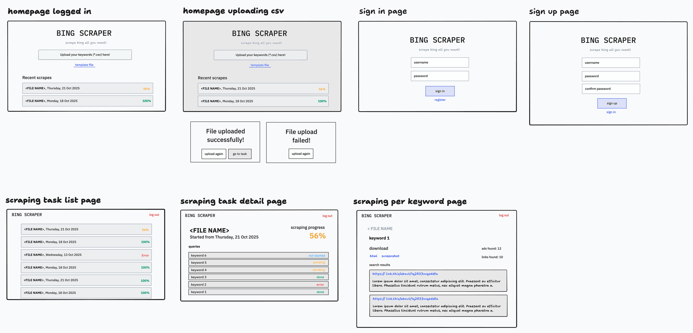

# Bing Scraper

This is a project to create a full fledge web application that scrapes Bing search results and displays them in a user-friendly manner. The project consists of user facing web app which allows users to upload csv files with search queries and displays the results, and scraper which will be responsible for scraping the Bing search results asynchronously and storing them in a database.

## Requirements

The system will be built using the following Cloudflare technologies:

### Web

- **Cloudflare Pages**: For hosting the user-facing web application.
- **Cloudflare Workers**: For handling backend logic and API requests.
- **Cloudflare D1**: For storing structured data and search results.
- **Cloudflare R2**: For storing uploaded CSV files and scraped data.

### Scraper

- **Cloudflare Queues**: For managing and processing scraping tasks asynchronously.
- **Cloudflare Workflows + Browser Rendering**: For executing the scraping logic and interacting with Bing.
- **Cloudflare KV**: For storing metadata and state information.
- **Cloudflare Durable Objects**: For managing stateful operations and coordinating scraping tasks.

### Additional Tools
- **Cloudflare Wrangler**: For deploying and managing Cloudflare Workers and other resources.
- **GitHub Actions**: For CI/CD and automating deployment processes.
- **TypeScript**: For writing type-safe code for both frontend and backend components.
- **React**: For building the user interface of the web application.
- **Vite**: For bundling and optimizing the frontend code.
- **tRPC**: For type-safe API communication between the frontend and backend.
- **Zod**: For schema validation and data parsing.
- **Drizzle ORM**: For interacting with the D1 database.
- **ESLint & Prettier**: For maintaining code quality and consistency.
- **Vitest**: For unit and integration testing.
- **Playwright**: For end-to-end testing of the web application.
- **Tailwind CSS**: For styling the web application.
- **Papaparse**: For parsing CSV files on the frontend.
- **Better-auth**: For handling user authentication and authorization.

## Project Structure

The project will be organized into the following directories:
- `apps/web/`: Contains the code for the user-facing web application.
- `apps/scraper/`: Contains the code for the scraping logic and backend services.
- `packages/database/`: Contains database schema and migration scripts.

## Tasks Breakdown

### Web Application
1. Set up Cloudflare Pages for hosting the web application.
2. Create a user interface using React and Tailwind CSS.
3. Implement file upload functionality to accept CSV files.
4. Set up API routes using Cloudflare Workers and tRPC.
5. Integrate with Cloudflare D1 and R2 for data storage.
6. Implement user authentication using better-auth.
7. Add error handling and notifications for user actions.
8. Write unit and integration tests using Vitest and Playwright.

### Scraper
1. Set up Cloudflare Queues for managing scraping tasks.
2. Implement scraping logic using Cloudflare Workflows and Browser Rendering.
3. Store scraped data in Cloudflare D1 and R2.
4. Use Cloudflare KV for storing metadata and state information.
5. Implement stateful operations using Cloudflare Durable Objects.
6. Write unit and integration tests for the scraper.

### Deployment
1. Set up CI/CD pipelines using GitHub Actions for automated deployment.
2. Configure Cloudflare Wrangler for deploying Workers and other resources.
3. Set up environment variables and secrets management.
4. Create deployment scripts for both web and scraper applications.

## Database Schema

The database schema is designed to support user authentication, CSV file uploads, search query management, asynchronous scraping tasks, and detailed search result storage.

### Schema Overview

- **users**: User accounts and authentication
- **uploaded_files**: CSV file metadata and R2 storage references
- **search_queries**: Individual search queries extracted from CSV files
- **scraping_tasks**: Asynchronous task management with status tracking
- **search_results**: Search result metadata per query
- **search_result_items**: Individual result links and details from Bing

### Tables

```sql
-- User management and authentication
CREATE TABLE users (
    id TEXT PRIMARY KEY,                    -- UUID or Better Auth generated ID
    email TEXT NOT NULL UNIQUE,             -- User email for login
    username TEXT UNIQUE,                   -- Optional username
    name TEXT,                              -- Display name
    email_verified INTEGER DEFAULT 0,       -- Email verification status
    image TEXT,                             -- Profile image URL
    created_at INTEGER NOT NULL,            -- Unix timestamp
    updated_at INTEGER NOT NULL             -- Unix timestamp
);

-- Better Auth sessions table
CREATE TABLE sessions (
    id TEXT PRIMARY KEY,
    user_id TEXT NOT NULL,
    expires_at INTEGER NOT NULL,
    token TEXT NOT NULL UNIQUE,
    ip_address TEXT,
    user_agent TEXT,
    created_at INTEGER NOT NULL,
    updated_at INTEGER NOT NULL,
    FOREIGN KEY (user_id) REFERENCES users(id) ON DELETE CASCADE
);

-- Better Auth accounts table (for OAuth providers)
CREATE TABLE accounts (
    id TEXT PRIMARY KEY,
    user_id TEXT NOT NULL,
    account_id TEXT NOT NULL,
    provider_id TEXT NOT NULL,
    access_token TEXT,
    refresh_token TEXT,
    expires_at INTEGER,
    scope TEXT,
    password TEXT,                          -- Hashed password for credential provider
    created_at INTEGER NOT NULL,
    updated_at INTEGER NOT NULL,
    FOREIGN KEY (user_id) REFERENCES users(id) ON DELETE CASCADE,
    UNIQUE(provider_id, account_id)
);

-- Uploaded CSV files with R2 storage references
CREATE TABLE uploaded_files (
    id TEXT PRIMARY KEY,                    -- UUID
    user_id TEXT NOT NULL,
    file_name TEXT NOT NULL,                -- Original filename
    r2_key TEXT NOT NULL UNIQUE,            -- R2 storage key
    r2_bucket TEXT NOT NULL,                -- R2 bucket name
    total_queries INTEGER DEFAULT 0,        -- Total queries in CSV
    processed_queries INTEGER DEFAULT 0,    -- Processed count
    status TEXT NOT NULL DEFAULT 'pending', -- pending, processing, completed, failed
    error_message TEXT,                     -- Error details if failed
    uploaded_at INTEGER NOT NULL,           -- Unix timestamp
    processed_at INTEGER,                   -- Unix timestamp when processing completed
    created_at INTEGER NOT NULL,
    updated_at INTEGER NOT NULL,
    FOREIGN KEY (user_id) REFERENCES users(id) ON DELETE CASCADE
);

-- Individual search queries extracted from CSV files
CREATE TABLE search_queries (
    id TEXT PRIMARY KEY,                    -- UUID
    uploaded_file_id TEXT NOT NULL,
    user_id TEXT NOT NULL,
    query_text TEXT NOT NULL,               -- The search query string
    status TEXT NOT NULL DEFAULT 'pending', -- pending, queued, scraping, completed, failed
    retry_count INTEGER DEFAULT 0,          -- Number of retry attempts
    max_retries INTEGER DEFAULT 3,          -- Maximum retry attempts
    error_message TEXT,                     -- Error details if failed
    created_at INTEGER NOT NULL,
    updated_at INTEGER NOT NULL,
    FOREIGN KEY (uploaded_file_id) REFERENCES uploaded_files(id) ON DELETE CASCADE,
    FOREIGN KEY (user_id) REFERENCES users(id) ON DELETE CASCADE
);

-- Scraping tasks for queue management
CREATE TABLE scraping_tasks (
    id TEXT PRIMARY KEY,                    -- UUID
    search_query_id TEXT NOT NULL,
    uploaded_file_id TEXT NOT NULL,
    user_id TEXT NOT NULL,
    status TEXT NOT NULL DEFAULT 'pending', -- pending, queued, running, completed, failed, cancelled
    workflow_id TEXT,                       -- Cloudflare Workflow instance ID
    queue_message_id TEXT,                  -- Cloudflare Queue message ID
    started_at INTEGER,                     -- Unix timestamp when scraping started
    completed_at INTEGER,                   -- Unix timestamp when completed
    duration_ms INTEGER,                    -- Task duration in milliseconds
    error_message TEXT,                     -- Error details if failed
    retry_count INTEGER DEFAULT 0,
    metadata TEXT,                          -- JSON metadata (browser info, etc.)
    created_at INTEGER NOT NULL,
    updated_at INTEGER NOT NULL,
    FOREIGN KEY (search_query_id) REFERENCES search_queries(id) ON DELETE CASCADE,
    FOREIGN KEY (uploaded_file_id) REFERENCES uploaded_files(id) ON DELETE CASCADE,
    FOREIGN KEY (user_id) REFERENCES users(id) ON DELETE CASCADE
);

-- Search result metadata per query
CREATE TABLE search_results (
    id TEXT PRIMARY KEY,                    -- UUID
    task_id TEXT NOT NULL,
    query_id TEXT NOT NULL,
    user_id TEXT NOT NULL,
    query_text TEXT NOT NULL,               -- Denormalized for quick access
    total_results INTEGER DEFAULT 0,        -- Total number of result items
    page_title TEXT,                        -- Bing page title
    search_url TEXT,                        -- Full Bing search URL
    scraped_at INTEGER NOT NULL,            -- Unix timestamp
    r2_screenshot_key TEXT,                 -- Optional screenshot in R2
    r2_html_key TEXT,                       -- Optional full HTML in R2
    metadata TEXT,                          -- JSON metadata (ads count, related searches, etc.)
    created_at INTEGER NOT NULL,
    updated_at INTEGER NOT NULL,
    FOREIGN KEY (task_id) REFERENCES scraping_tasks(id) ON DELETE CASCADE,
    FOREIGN KEY (query_id) REFERENCES search_queries(id) ON DELETE CASCADE,
    FOREIGN KEY (user_id) REFERENCES users(id) ON DELETE CASCADE,
    UNIQUE(task_id, query_id)
);

-- Individual search result items (links) from Bing
CREATE TABLE search_result_items (
    id TEXT PRIMARY KEY,                    -- UUID
    search_result_id TEXT NOT NULL,
    query_id TEXT NOT NULL,
    position INTEGER NOT NULL,              -- Position in search results (1-based)
    title TEXT NOT NULL,                    -- Result title
    url TEXT NOT NULL,                      -- Result URL
    display_url TEXT,                       -- Displayed URL (may differ from actual)
    snippet TEXT,                           -- Result description/snippet
    type TEXT DEFAULT 'organic',            -- organic, ad, featured, news, video, etc.
    domain TEXT,                            -- Extracted domain
    is_ad INTEGER DEFAULT 0,                -- Whether this is an advertisement
    metadata TEXT,                          -- JSON metadata (date, rating, etc.)
    created_at INTEGER NOT NULL,
    FOREIGN KEY (search_result_id) REFERENCES search_results(id) ON DELETE CASCADE,
    FOREIGN KEY (query_id) REFERENCES search_queries(id) ON DELETE CASCADE
);

-- Indexes for performance optimization
CREATE INDEX idx_sessions_user_id ON sessions(user_id);
CREATE INDEX idx_sessions_token ON sessions(token);
CREATE INDEX idx_accounts_user_id ON accounts(user_id);
CREATE INDEX idx_uploaded_files_user_id ON uploaded_files(user_id);
CREATE INDEX idx_uploaded_files_status ON uploaded_files(status);
CREATE INDEX idx_search_queries_file_id ON search_queries(file_id);
CREATE INDEX idx_search_queries_user_id ON search_queries(user_id);
CREATE INDEX idx_search_queries_status ON search_queries(status);
CREATE INDEX idx_scraping_tasks_query_id ON scraping_tasks(query_id);
CREATE INDEX idx_scraping_tasks_status ON scraping_tasks(status);
CREATE INDEX idx_scraping_tasks_user_id ON scraping_tasks(user_id);
CREATE INDEX idx_search_results_task_id ON search_results(task_id);
CREATE INDEX idx_search_results_query_id ON search_results(query_id);
CREATE INDEX idx_search_results_user_id ON search_results(user_id);
CREATE INDEX idx_search_result_items_search_result_id ON search_result_items(search_result_id);
CREATE INDEX idx_search_result_items_query_id ON search_result_items(query_id);
```

### Schema Notes

1. **Unix Timestamps**: Using INTEGER for timestamps (Unix epoch) for better D1 compatibility
2. **Text IDs**: Using TEXT for IDs to support UUIDs and Better Auth's ID format
3. **Denormalization**: Some fields like `query_text` and `user_id` are denormalized for query performance
4. **Status Fields**: Extensive status tracking for async processing
5. **R2 References**: Storage keys for files, screenshots, and HTML content
6. **Better Auth Tables**: Compatible with Better Auth v1.3.4 schema requirements
7. **Indexes**: Strategic indexes for common query patterns
8. **Metadata Fields**: JSON text fields for flexible additional data storage
9. **Cascading Deletes**: Proper foreign key constraints with CASCADE for data cleanup

## Frontend Mockup




